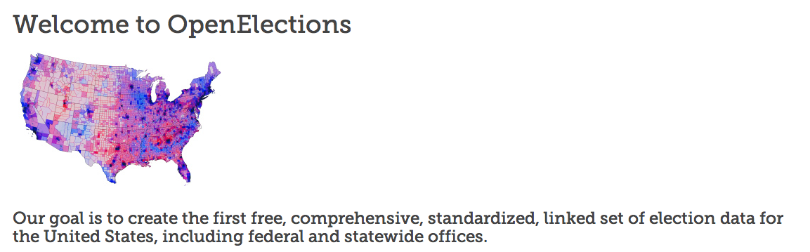
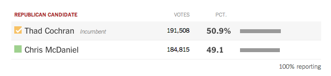

OpenElections
==========================

#### Presentation notes for GNDEM 2014 workshop
#### Derek Willis, [OpenElections](http://openelections.net/)

* What we're doing
* Why is this important?  [Context](http://www.nytimes.com/2014/07/10/upshot/voting-totals-reveal-crucial-boost-from-blacks-in-cochrans-victory.html).
* Transparency in [process](http://docs.openelections.net/), [code](https://github.com/openelections) and [data](https://github.com/openelections/openelections-data-ms) 
* [Publishing results](http://openelex-website-demo.s3-website-us-east-1.amazonaws.com/)

## Collecting and Standardizing Results

* Collecting at the lowest level
* The easy and [hard](https://github.com/openelections/openelections-data-ms) bits
* Using [standards](http://docs.opencivicdata.org/en/latest/proposals/0002.html)
* Transparent [specs](https://github.com/openelections/specs/wiki) and [raw data](https://github.com/openelections/openelections-data-wy/tree/master/raw)
* Tools

## Reasonable Restrictions

* The work it takes to produce data
* Privacy & timeliness
* Recognizing good faith vs the opposite, and changing topics
* Meeting with and providing feedback to election officials

## More Information and Code

* [Documentation](http://docs.openelections.net/)
* [Our Code](https://github.com/openelections)
* [Our Blog](http://blog.openelections.net/)
* [Election Data Spec](https://github.com/openelections/specs/wiki/Elections-Data-Spec-Version-2)
* [Results Data Spec](https://github.com/openelections/specs/wiki/Results-Data-Spec-Version-2)

## Things to See

* [Comparing elections](http://www.nytimes.com/interactive/2014/06/24/nyregion/rangel-election-results.html)
* [Mississippi results analysis 1](http://www.nytimes.com/2014/07/10/upshot/voting-totals-reveal-crucial-boost-from-blacks-in-cochrans-victory.html)
* [Mississippi results analysis 2](http://www.nytimes.com/2014/07/15/upshot/more-evidence-that-thad-cochran-owes-runoff-win-to-black-voters.html)
* [OpenElections raw results demo](http://openelex-website-demo.s3-website-us-east-1.amazonaws.com/)

## Tools to Use

* [Tabula](http://tabula.nerdpower.org/)
* [Open Civic Data IDs](http://docs.opencivicdata.org/en/latest/proposals/0002.html)
* [CSVKit](https://csvkit.readthedocs.org/)
* [TableSplitter](https://github.com/ghing/tablesplitter)
* [Google Spreadsheets Name Splitter](https://chrome.google.com/webstore/detail/split-names/omjobieogknhhlogiaeofbdpipihaanb)

